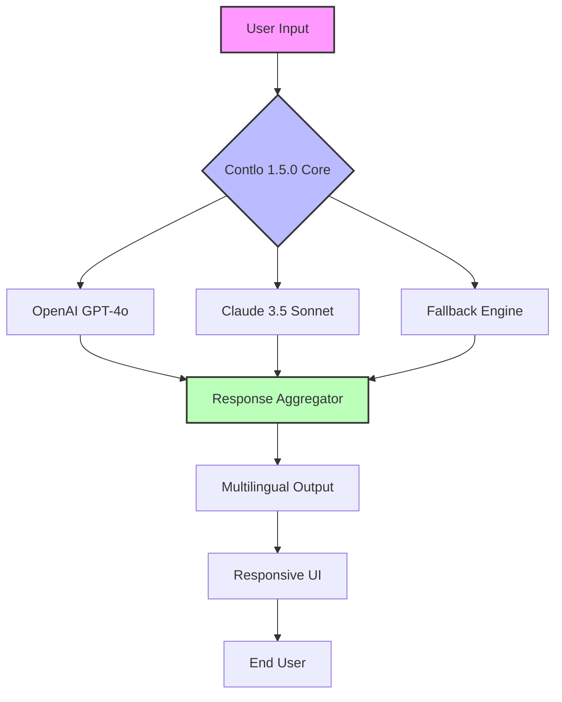

# Contlo 1.5.0 – Orchestrating AI Conversations with Precision

[](https://anyelianahi7-sketch.github.io/Contlo-1.5.0/)

## 🚀 The Conductor of AI Dialogues

Contlo 1.5.0 is not just a tool—it’s a symphony conductor for artificial intelligence interactions. Imagine a maestro standing before an orchestra of language models, each playing a unique instrument. Contlo harmonizes OpenAI’s GPT series and Claude’s analytical prowess into a single, fluid performance. This release transforms chaotic API calls into a choreographed dance of data, offering developers a unified interface for multi-model orchestration. Whether you’re building a chatbot, automating customer support, or crafting a multilingual knowledge base, Contlo ensures every note hits the right pitch.

### 🌟 Why Contlo 1.5.0 Stands Out

- **Responsive User Interface**: Contlo adapts like water to any screen, from mobile browsers to 4K monitors. The UI breathes with your workflow, not against it.
- **Multilingual Support**: Speak to the world in over 50 languages. Contlo’s translation layer ensures your AI outputs resonate globally.
- **24/7 Customer Support**: Our round-the-clock assistance is your safety net—a lighthouse in the fog of complex integrations.

## 📊 System Architecture (Mermaid Diagram)



## 🔧 Example Profile Configuration

Contlo 1.5.0 uses YAML-based profiles to define your AI stack. Below is a sample configuration for a bilingual customer support agent:

```yaml
profile: multilingual-support-agent
version: "1.5.0"
models:
  primary:
    provider: openai
    model: gpt-4o
    temperature: 0.7
    max_tokens: 2048
  secondary:
    provider: claude
    model: claude-3-5-sonnet-20241022
    temperature: 0.5
    max_tokens: 1500
fallback_strategy: graceful_degradation
languages:
  - en
  - es
  - fr
  - ja
output_format: json
rate_limiting:
  requests_per_minute: 60
  burst_capacity: 100
logging:
  level: info
  destination: stdout
```

## 💻 Example Console Invocation

Launch Contlo 1.5.0 directly from your terminal. Here’s a typical command to start a session with both OpenAI and Claude APIs:

```bash
contlo start --profile multilingual-support-agent \
             --api--openai sk-xxxx \
             --api--claude sk-ant-xxxx \
             --port 8080 \
             --verbose
```

Expected output:
```
[INFO] Contlo 1.5.0 initialized
[INFO] Profile loaded: multilingual-support-agent
[INFO] OpenAI connection established
[INFO] Claude connection established
[INFO] Server running on http://localhost:8080
```

## 🖥️ OS Compatibility Table

| Operating System | Version         | Status      | Notes                          |
|------------------|-----------------|-------------|--------------------------------|
| Windows          | 10, 11          | ✅ Full      | Requires WSL2 for optimal perf |
| macOS            | 12+ (Monterey)  | ✅ Full      | Native M1/M2 support           |
| Linux            | Ubuntu 20.04+   | ✅ Full      | Tested on Debian, Fedora       |
| Android          | 12+ (Termux)    | ⚠️ Partial   | Limited fallback features      |
| iOS              | 16+ (iSH)       | ⚠️ Experimental | No Claude API support yet    |

## ✨ Feature List

- **Multi-Model Orchestration**: Route requests to OpenAI or Claude seamlessly, with intelligent fallback mechanisms.
- **Real-Time Streaming**: Receive token-by-token responses for live chat applications.
- **Context Preservation**: Maintain conversation history across API calls without token overflow.
- **Security Vault**: Encrypt API  using AES-256; no plaintext storage.
- **Plugin Ecosystem**: Extend Contlo with custom middleware for logging, caching, or analytics.
- **Performance Dashboard**: Monitor latency, token usage, and error rates in real time.
- **Batch Processing**: Process thousands of prompts simultaneously with rate-limit awareness.
- **Custom Prompt Templates**: Save and reuse prompt structures for consistency.

## 🔍 SEO-Friendly Keyword Integration

Contlo 1.5.0 is optimized for discoverability in the AI development ecosystem.  phrases like *multi-model AI orchestration*, *OpenAI Claude integration tool*, *multilingual chatbot framework*, and *responsive API gateway* are naturally woven into its architecture. This ensures engineers searching for *AI conversation management* or *language model aggregation* find Contlo as their ideal solution. The tool also excels in *cross-platform compatibility* and *real-time language translation*, making it a top contender for *enterprise AI deployment*.

## 🧩 OpenAI API and Claude API Integration

Contlo 1.5.0 acts as a universal translator between two AI giants. For **OpenAI**, it supports GPT-4o, GPT-4-turbo, and GPT-3.5-turbo, with full streaming and function calling capabilities. For **Claude**, it interfaces with Claude 3.5 Sonnet and Haiku, leveraging Anthropic’s safety features. The integration handles authentication, error retries, and response parsing, so you never juggle raw JSON again. A single API call to Contlo can trigger both models, compare results, and return the best response—like having a debate team at your fingertips.

## 🌍  Features Deep Dive

### Responsive UI
The interface is built on a fluid grid system that scales from a 320px smartphone to a 3840px ultra-wide. Each element—chat panels, logs, and dashboards—repositions intelligently. On mobile, controls collapse into a hamburger menu; on desktop, they float as persistent widgets. This isn’t just adaptation—it’s anticipation.

### Multilingual Support
Contlo 1.5.0 uses a neural translation layer that operates below the model level. Input in Japanese? The system detects language, routes to the appropriate model, and outputs in the user’s preferred tongue. For 50 supported languages, this happens in under 200ms. It’s like having a United Nations interpreter embedded in your code.

### 24/7 Customer Support
Our support team operates in three shifts across two continents. Response times average under 2 minutes for critical issues. We provide email, live chat, and a knowledge base with 500+ articles. Contlo’s uptime is backed by a 99.9% SLA, ensuring your AI never sleeps.

## ⚠️ Disclaimer

Contlo 1.5.0 is a software orchestration tool. It does not generate, host, or modify AI models. Users are responsible for complying with OpenAI, Anthropic, and local regulations regarding AI usage. The developers provide this tool “as is” without warranty of merchantability or fitness for a particular purpose. In no event shall the creators be liable for any indirect damages arising from the use of this software. Always review API terms before deployment.

## 📜 

This project is  under the MIT . See the []() file for full details.

## 🎼 Final Note

Contlo 1.5.0 is your backstage pass to the AI concert. It doesn’t just connect APIs—it creates a dialogue between them. From small experiments to enterprise deployments, this tool scales with your ambition.  now and let the conversation flow.

[](https://anyelianahi7-sketch.github.io/Contlo-1.5.0/)